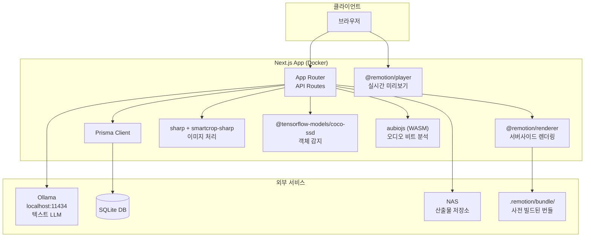
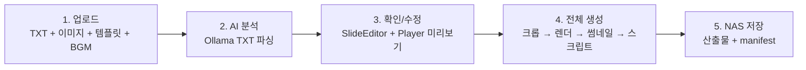
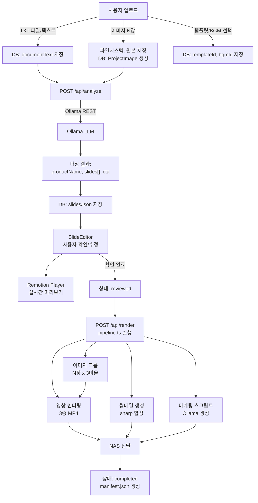
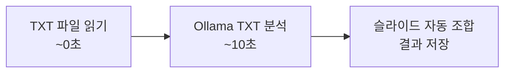
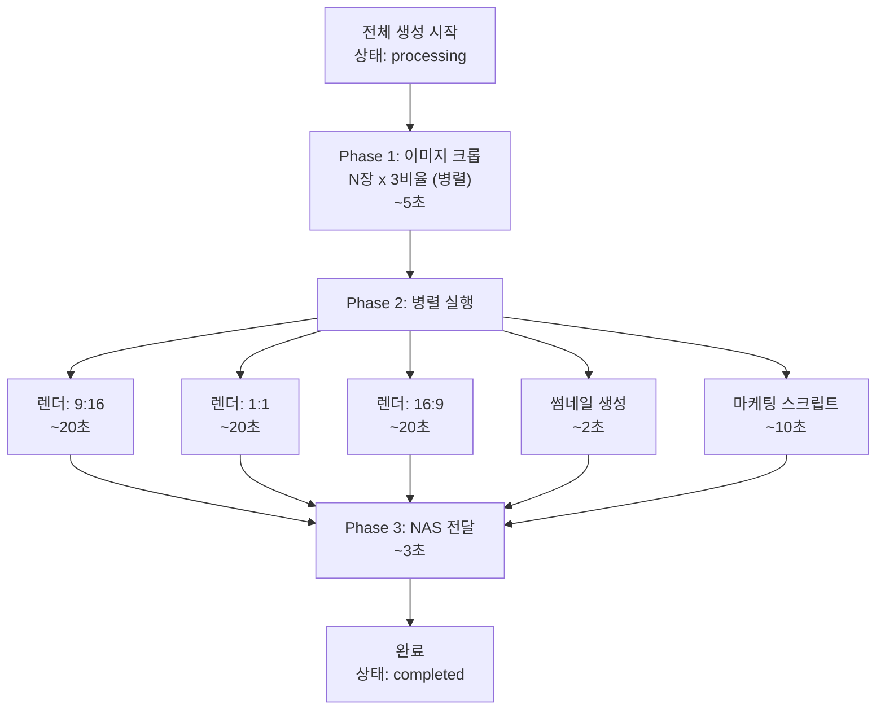
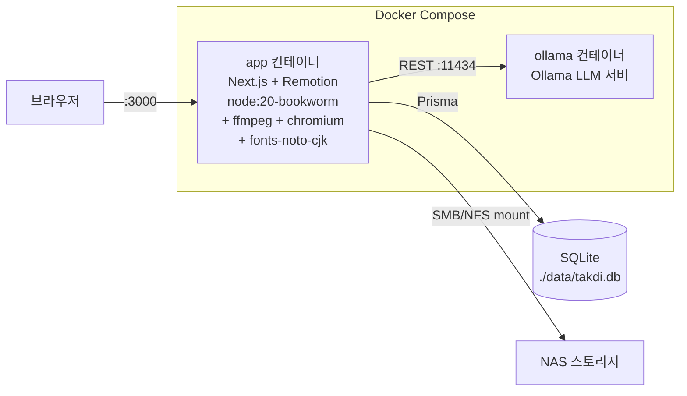

# 탁디장 스튜디오 - 시스템 아키텍처

> **버전:** 2.1.0
> **최종 수정:** 2026-03-05

---

## 1. 시스템 토폴로지



### 핵심 컴포넌트 설명

| 컴포넌트 | 역할 | 비고 |
|----------|------|------|
| Next.js App Router | 웹 UI + API 서버 | 단일 프로세스 |
| Remotion Player | 브라우저 내 실시간 미리보기 | 클라이언트 사이드 |
| Remotion Renderer | 서버에서 MP4 렌더링 | 사전 빌드된 번들 사용 |
| Ollama | TXT 분석 + 마케팅 스크립트 생성 | REST API (localhost:11434) |
| SQLite | 프로젝트, 작업, 템플릿 등 저장 | Prisma ORM, 운영비 0원 |
| NAS | 최종 산출물 저장 | SMB/NFS 마운트 |

---

## 2. 데이터 흐름도

### 2.1 전체 사용자 플로우



### 2.2 상세 데이터 흐름



---

## 3. 서비스 레이어 관계도

### 3.1 pipeline.ts 오케스트레이터

`pipeline.ts`는 전체 생성 프로세스를 조율하는 중앙 오케스트레이터이다.

```mermaid
flowchart TD
    Pipeline["pipeline.ts<br/>오케스트레이터"]

    Pipeline --> SmartCrop["image/smartCrop.ts<br/>스마트 크롭"]
    Pipeline --> ObjectDetect["image/objectDetect.ts<br/>객체 감지"]
    Pipeline --> ImageOpt["image/imageOptimize.ts<br/>이미지 최적화"]

    Pipeline --> RenderWorker["video/renderWorker.ts<br/>Remotion 렌더"]
    Pipeline --> SubtitleTiming["video/subtitleTiming.ts<br/>자막 타이밍"]

    Pipeline --> BeatAnalyzer["audio/beatAnalyzer.ts<br/>비트 분석"]
    Pipeline --> BeatSnap["audio/beatSnapEngine.ts<br/>비트 스냅"]

    Pipeline --> DocAnalyzer["llm/documentAnalyzer.ts<br/>TXT 분석"]
    Pipeline --> OllamaClient["llm/ollamaClient.ts<br/>Ollama 통신"]
    Pipeline --> PromptTpl["llm/promptTemplates.ts<br/>프롬프트 관리"]
    Pipeline --> ScriptParser["llm/scriptParser.ts<br/>LLM 출력 파서"]

    Pipeline --> ThumbGen["thumbnail/thumbnailGenerator.ts<br/>썸네일 생성"]

    Pipeline --> DeliveryMgr["output/deliveryManager.ts<br/>NAS 전달"]
    Pipeline --> ManifestWriter["output/manifestWriter.ts<br/>manifest 작성"]

    Pipeline --> Queue["queue/inMemoryQueue.ts<br/>작업 큐 관리"]

    SmartCrop --> ObjectDetect
    SubtitleTiming --> BeatSnap
    DocAnalyzer --> OllamaClient
    DocAnalyzer --> PromptTpl
    DocAnalyzer --> ScriptParser
```



### 3.2 서비스 디렉토리 구조

```
src/services/
├── pipeline.ts              # 전체 오케스트레이터
├── queue/
│   └── inMemoryQueue.ts     # Redis 없이 인메모리 작업 큐
├── image/
│   ├── smartCrop.ts         # sharp + smartcrop-sharp 기반 스마트 크롭
│   ├── objectDetect.ts      # coco-ssd 객체 감지 (피사체 중심점)
│   └── imageOptimize.ts     # 리사이즈, 포맷 최적화
├── video/
│   ├── renderWorker.ts      # @remotion/renderer 호출
│   ├── subtitleTiming.ts    # 텍스트 가독성 기반 슬라이드 타이밍
│   └── compositions/        # Remotion 컴포지션 컴포넌트
├── audio/
│   ├── beatAnalyzer.ts      # aubiojs WASM 비트 감지
│   └── beatSnapEngine.ts    # 슬라이드 경계 → 비트 스냅
├── llm/
│   ├── ollamaClient.ts      # Ollama REST API 클라이언트
│   ├── documentAnalyzer.ts  # TXT → 슬라이드 자동 분류/배분
│   ├── promptTemplates.ts   # 분석용 + 스크립트용 프롬프트
│   └── scriptParser.ts      # LLM JSON 출력 파서
├── thumbnail/
│   └── thumbnailGenerator.ts
└── output/
    ├── deliveryManager.ts   # NAS 복사
    └── manifestWriter.ts    # JSON manifest 생성
```

---

## 4. 파이프라인 실행 순서

### 4.1 사전 분석 단계 (사용자 확인 전)



순차 실행. 총 ~10초.

### 4.2 생성 단계 ("전체 생성" 클릭 후)



### 4.2.1 실행 규칙

| 규칙 | 설명 |
|------|------|
| 크롭 우선 | 이미지 크롭은 렌더링보다 먼저 완료되어야 함 (렌더가 크롭된 이미지를 사용) |
| 렌더 병렬 제한 | `MAX_CONCURRENT_RENDERS=2` (하드웨어에 따라 조절). 3종 중 2종 동시 → 나머지 1종 |
| 썸네일/스크립트 병렬 | 렌더와 동시에 실행 가능 (독립적) |
| NAS 전달은 최후 | 모든 산출물 생성 완료 후 실행 |
| 실패 처리 | 개별 작업 실패 시 해당 VideoJob.status="failed", errorMessage 기록. 나머지는 계속 진행 |

### 4.3 VideoJob 타입별 실행 순서

```
crop_images   → 순차 1번째 (선행 조건)
render_916    ─┐
render_1x1    ─┼→ 병렬 2번째 (MAX_CONCURRENT_RENDERS 제한)
render_169    ─┘
thumbnail     ─┬→ 병렬 2번째 (렌더와 동시)
script        ─┘
```

---

## 5. 배포 토폴로지

### 5.1 Docker Compose 구성



### 5.2 핵심 Docker 설정

| 설정 | 값 | 이유 |
|------|----|------|
| shm_size | 2gb | Chromium 렌더링에 공유 메모리 필요 |
| fonts-noto-cjk | 설치 필수 | 한국어 텍스트 렌더링 |
| ffmpeg | 설치 필수 | Remotion 영상 인코딩 |
| chromium | 설치 필수 | Remotion 렌더러 의존 |

### 5.3 환경 변수

```
DATABASE_URL=file:./data/takdi.db
OLLAMA_BASE_URL=http://ollama:11434
NAS_OUTPUT_DIR=/mnt/nas/takdi-output
MAX_CONCURRENT_RENDERS=2
REMOTION_BUNDLE_PATH=.remotion/bundle
```
