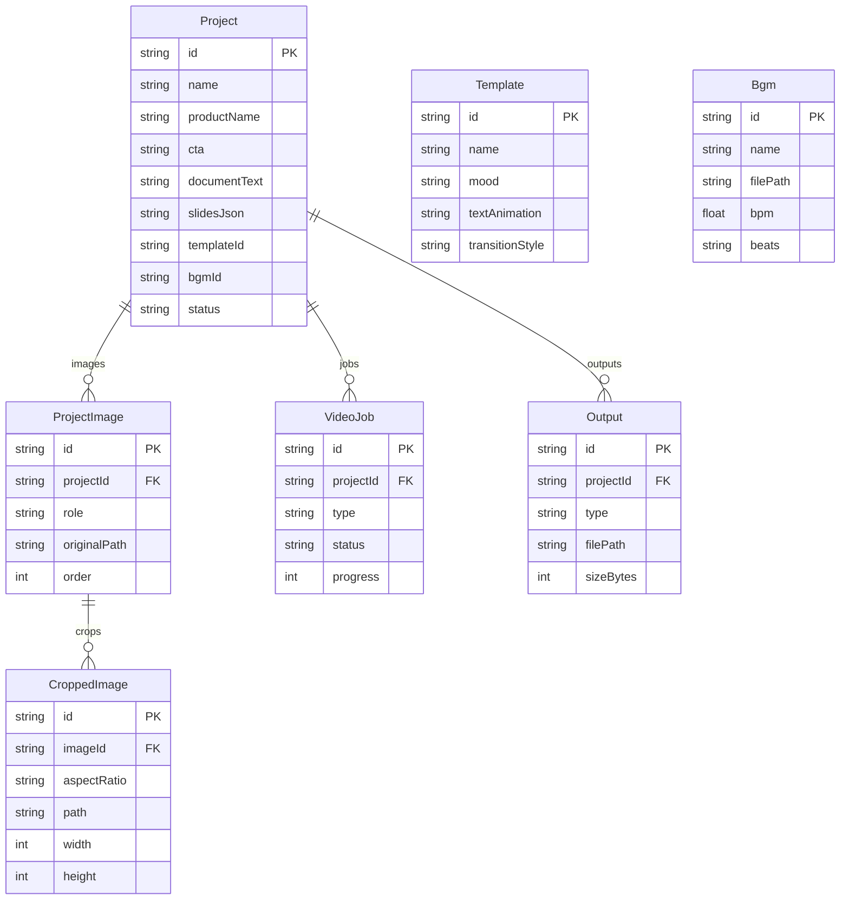

# 탁디장 스튜디오 - DB 스키마 인덱스

> **버전:** 2.1.0
> **최종 수정:** 2026-03-05
> **DB:** SQLite via Prisma 5.x

---

## 1. 데이터소스

```prisma
datasource db {
  provider = "sqlite"
  url      = env("DATABASE_URL")  // file:./data/takdi.db
}
```

---

## 2. 모델 상세

### 2.1 Project

프로젝트 최상위 엔티티. 하나의 영상 생성 작업 단위.

| 필드 | 타입 | 제약조건 | 설명 |
|------|------|----------|------|
| id | String | @id @default(cuid()) | 기본키 |
| name | String | 필수 | 프로젝트명 |
| productName | String | @default("") | AI가 TXT에서 추출한 제품명 |
| cta | String | @default("") | AI가 TXT에서 추출한 CTA 문구 |
| documentText | String | @default("") | 업로드된 TXT 원문 전체 |
| slidesJson | String | @default("[]") | AI 분석 결과 JSON: `[{text, imageId, order}]` |
| templateId | String | 필수 | 선택된 템플릿 ID |
| bgmId | String | 필수 | 선택된 BGM ID |
| status | String | @default("draft") | 프로젝트 상태 (ProjectStatus 참조) |
| createdAt | DateTime | @default(now()) | 생성 시각 |
| updatedAt | DateTime | @updatedAt | 수정 시각 |

**관계:**
- `images` → ProjectImage[] (1:N)
- `jobs` → VideoJob[] (1:N)
- `outputs` → Output[] (1:N)

---

### 2.2 ProjectImage

프로젝트에 업로드된 개별 이미지.

| 필드 | 타입 | 제약조건 | 설명 |
|------|------|----------|------|
| id | String | @id @default(cuid()) | 기본키 |
| projectId | String | FK → Project.id | 소속 프로젝트 |
| role | String | 필수 | 이미지 역할 (AI 자동 배정 또는 사용자 수정) |
| originalPath | String | 필수 | 원본 이미지 파일 경로 |
| order | Int | 필수 | 슬라이드 내 순서 |

**관계:**
- `project` → Project (N:1, onDelete: Cascade)
- `crops` → CroppedImage[] (1:N)

**이미지 역할(role) 예시값:**
- `main_cut` - 메인 제품 이미지
- `model_cut` - 모델 착용/사용 이미지
- `detail_cut` - 성분/디테일 클로즈업
- `problem_cut` - 문제 제기용 이미지
- `lifestyle_cut` - 라이프스타일 이미지

---

### 2.3 CroppedImage

스마트 크롭된 이미지. 원본 1장당 최대 3장(비율별).

| 필드 | 타입 | 제약조건 | 설명 |
|------|------|----------|------|
| id | String | @id @default(cuid()) | 기본키 |
| imageId | String | FK → ProjectImage.id | 원본 이미지 |
| aspectRatio | String | 필수 | 비율: "9:16", "1:1", "16:9" |
| path | String | 필수 | 크롭된 이미지 파일 경로 |
| width | Int | 필수 | 크롭 결과 너비 (px) |
| height | Int | 필수 | 크롭 결과 높이 (px) |
| cropX | Int | 필수 | 크롭 시작점 X 좌표 |
| cropY | Int | 필수 | 크롭 시작점 Y 좌표 |

**관계:**
- `image` → ProjectImage (N:1, onDelete: Cascade)

---

### 2.4 VideoJob

렌더링/처리 작업 단위. 파이프라인의 각 단계가 하나의 Job.

| 필드 | 타입 | 제약조건 | 설명 |
|------|------|----------|------|
| id | String | @id @default(cuid()) | 기본키 |
| projectId | String | FK → Project.id | 소속 프로젝트 |
| type | String | 필수 | 작업 유형 (JobType 참조) |
| status | String | @default("pending") | 작업 상태 (JobStatus 참조) |
| progress | Int | @default(0) | 진행률 (0-100) |
| outputPath | String? | 선택 | 산출물 파일 경로 |
| errorMessage | String? | 선택 | 실패 시 에러 메시지 |
| startedAt | DateTime? | 선택 | 작업 시작 시각 |
| completedAt | DateTime? | 선택 | 작업 완료 시각 |
| createdAt | DateTime | @default(now()) | 레코드 생성 시각 |

**관계:**
- `project` → Project (N:1, onDelete: Cascade)

---

### 2.5 Template

영상 템플릿 설정. 시드 데이터로 4개 기본 제공.

| 필드 | 타입 | 제약조건 | 설명 |
|------|------|----------|------|
| id | String | @id @default(cuid()) | 기본키 |
| name | String | 필수 | 템플릿 이름 |
| mood | String | 필수 | 감성, 모던, 강렬, 미니멀 |
| previewImagePath | String | 필수 | 미리보기 이미지 경로 |
| colorPalette | String | 필수 | JSON: `{primary, secondary, accent, text, background}` |
| fontFamily | String | 필수 | 사용 폰트 |
| textAnimation | String | 필수 | 텍스트 애니메이션 타입 (TextAnimation 참조) |
| transitionStyle | String | 필수 | 전환 효과 (TransitionStyle 참조) |

**관계:** 없음 (독립 엔티티, templateId로 참조)

---

### 2.6 Bgm

BGM 음원 메타데이터. 비트 분석 결과를 캐시.

| 필드 | 타입 | 제약조건 | 설명 |
|------|------|----------|------|
| id | String | @id @default(cuid()) | 기본키 |
| name | String | 필수 | BGM 이름 |
| filePath | String | 필수 | 음원 파일 경로 |
| durationSeconds | Float | 필수 | 재생 길이 (초) |
| bpm | Float | 필수 | BPM (beats per minute) |
| beats | String | 필수 | JSON: `BeatMarker[]` — 비트 타임스탬프 배열 |
| mood | String | 필수 | 분위기 태그 |

**관계:** 없음 (독립 엔티티, bgmId로 참조)

**BeatMarker 구조:**
```typescript
interface BeatMarker {
  timeSeconds: number;  // 비트 발생 시각 (초)
  strength: number;     // 비트 강도 (0.0 ~ 1.0)
}
```

---

### 2.7 Output

생성된 산출물 레코드.

| 필드 | 타입 | 제약조건 | 설명 |
|------|------|----------|------|
| id | String | @id @default(cuid()) | 기본키 |
| projectId | String | FK → Project.id | 소속 프로젝트 |
| type | String | 필수 | 산출물 유형 (OutputType 참조) |
| filePath | String | 필수 | 파일 경로 |
| sizeBytes | Int | 필수 | 파일 크기 (bytes) |
| format | String | 필수 | 파일 포맷 (mp4, jpg, txt 등) |
| createdAt | DateTime | @default(now()) | 생성 시각 |

**관계:**
- `project` → Project (N:1, onDelete: Cascade)

---

## 3. 모델간 관계도



### Cascade Delete 정책

| 부모 삭제 시 | 자식 동작 |
|-------------|----------|
| Project 삭제 | ProjectImage, VideoJob, Output 모두 cascade 삭제 |
| ProjectImage 삭제 | CroppedImage 모두 cascade 삭제 |
| Template 삭제 | Project.templateId는 남음 (FK 제약 없음, 논리적 참조) |
| Bgm 삭제 | Project.bgmId는 남음 (FK 제약 없음, 논리적 참조) |

---

## 4. Status Enum 값 정리

### 4.1 ProjectStatus (Project.status)

| 값 | 설명 | 전이 가능 상태 |
|----|------|----------------|
| `draft` | 초기 상태. 업로드 완료, 분석 전 | → analyzing |
| `analyzing` | AI가 TXT 분석 중 | → reviewed, failed |
| `reviewed` | 사용자가 AI 결과를 확인/수정 완료 | → processing |
| `processing` | "전체 생성" 실행 중 | → completed, failed |
| `completed` | 모든 산출물 생성 + NAS 전달 완료 | (최종) |
| `failed` | 분석 또는 생성 실패 | → draft, analyzing, reviewed (재시도) |

**상태 전이 다이어그램:**
```
draft → analyzing → reviewed → processing → completed
  ↑        ↓            ↑           ↓
  └── failed ───────────┘───────────┘
```

### 4.2 JobStatus (VideoJob.status)

| 값 | 설명 |
|----|------|
| `pending` | 대기 중. 큐에 등록됨 |
| `running` | 실행 중. progress 업데이트 |
| `completed` | 성공 완료. outputPath 설정됨 |
| `failed` | 실패. errorMessage 설정됨 |

### 4.3 JobType (VideoJob.type)

| 값 | 설명 | 실행 순서 |
|----|------|-----------|
| `crop_images` | N장 이미지 x 3비율 스마트 크롭 | Phase 1 (순차 선행) |
| `render_916` | 9:16 세로 영상 렌더링 | Phase 2 (병렬) |
| `render_1x1` | 1:1 정사각형 영상 렌더링 | Phase 2 (병렬) |
| `render_169` | 16:9 가로 영상 렌더링 | Phase 2 (병렬) |
| `thumbnail` | 썸네일 이미지 생성 | Phase 2 (병렬) |
| `script` | 마케팅 스크립트 생성 | Phase 2 (병렬) |

### 4.4 OutputType (Output.type)

| 값 | format | 설명 |
|----|--------|------|
| `video_916` | mp4 | 9:16 세로 영상 |
| `video_1x1` | mp4 | 1:1 정사각형 영상 |
| `video_169` | mp4 | 16:9 가로 영상 |
| `thumbnail` | jpg | 대표 썸네일 이미지 |
| `script` | txt | 마케팅 스크립트 텍스트 |

### 4.5 TextAnimation (Template.textAnimation)

| 값 | 설명 | 폰트 |
|----|------|------|
| `fade_serif` | 부드러운 페이드인 + 약간의 스케일 | Noto Serif KR |
| `slide_modern` | 슬라이드인 + 클린한 모션 | Pretendard |
| `scale_bold` | 빠른 스케일업 + 바운스 | Pretendard (900) |
| `simple_minimal` | 단순 페이드 + 정적 텍스트 | Pretendard (300) |

### 4.6 TransitionStyle (Template.transitionStyle)

| 값 | 설명 |
|----|------|
| `fade` | 크로스 페이드 |
| `slide_left` | 왼쪽으로 슬라이드 |
| `slide_up` | 위로 슬라이드 |
| `zoom` | 줌 인/아웃 |
| `cut` | 즉시 전환 (컷) |

---

## 5. 인덱스 정책

SQLite에서 Prisma가 자동 생성하는 인덱스 외에, 다음 쿼리 패턴을 고려한 인덱스가 필요하다.

### 5.1 자동 인덱스 (Prisma 기본)

| 모델 | 필드 | 인덱스 타입 | 비고 |
|------|------|-------------|------|
| 모든 모델 | id | PRIMARY KEY | cuid() |
| ProjectImage | projectId | FK INDEX | 자동 생성 |
| CroppedImage | imageId | FK INDEX | 자동 생성 |
| VideoJob | projectId | FK INDEX | 자동 생성 |
| Output | projectId | FK INDEX | 자동 생성 |

### 5.2 추가 권장 인덱스

| 모델 | 필드 | 이유 |
|------|------|------|
| Project | status | 대시보드에서 상태별 필터링 빈번 |
| Project | createdAt | 목록 정렬 (최신순) |
| VideoJob | status | 활성 작업 조회 (pending, running) |
| VideoJob | (projectId, type) | 프로젝트별 특정 타입 작업 조회 |

```prisma
// schema.prisma에 추가 권장
model Project {
  // ...필드 생략...
  @@index([status])
  @@index([createdAt])
}

model VideoJob {
  // ...필드 생략...
  @@index([status])
  @@index([projectId, type])
}
```

### 5.3 인덱스 주의사항

- SQLite는 단일 파일 DB이므로 과도한 인덱스는 쓰기 성능 저하를 유발할 수 있다.
- 현재 규모(사내 도구, 소량 데이터)에서는 위 인덱스만으로 충분하다.
- 프로젝트 수가 1,000건을 초과하면 추가 인덱스 검토.
