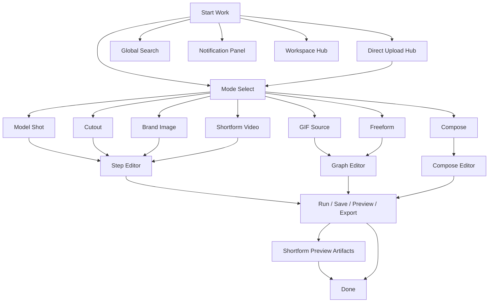

# Takdi User Flow

Version: 1.6.0
Last Updated: 2026-03-08 (KST)

Related spec:
- `docs/ref/WIREFRAME-NODE-BYOI.md`

## End-to-End Flow
1. Create a project from home or the global `작업 시작` launcher.
2. Optionally open the shared direct upload hub, stage local assets first, and choose the target mode after staging.
3. Select a mode and enter the matching editor surface.
4. Run generation or upload flow depending on the selected mode.
5. For `shortform-video`, generate preview-only artifacts (`thumbnail`, `marketing-script`) from `/preview` when needed.
6. Preview, render, and export the final artifact.
7. Review usage and recent activity from workspace/settings summaries.

## Flow Diagram

## Input Contract
| Field | Required | Rule |
|---|---|---|
| Brief text | Yes | Direct paste or structured project brief |
| Images | Conditional | Required for upload-driven modes |
| Mode | Yes | `model-shot`, `cutout`, `brand-image`, `gif-source`, `freeform`, `compose`, `shortform-video` |
| Project name | No | Auto-generated if omitted |

## Status Transition
- Project: `draft -> generating -> generated -> exported`
- Project fail path: `draft -> generating -> failed`
- Image/Text job: `queued -> running -> done | failed`

## Contract Keys
- `Asset.sourceType = uploaded | generated | byoi_edited`
- `CutHandoffPayload.preserveOriginal: boolean`

## Single-User Operation Rule
- UI exposes one-user flow only.
- Internal records remain workspace-scoped.

## Editor Surface Note
- `model-shot`, `cutout`, `brand-image`, and `shortform-video` default to a simple step-based editor for non-technical operators.
- `freeform` remains graph-first.
- Cost and run history are reviewed from `/settings`, not the main editor surface.

## Home Dashboard Note
- `/` opens directly into `새 작업 시작` without a hero summary card.
- The home screen prioritizes action selection first, then recent projects and saved templates.
- On home, `compose` is surfaced with a user-facing label `상세페이지 제작`.
- Home and the header launcher share the same mode definitions and the same `직접 업로드` staging hub.

## Header Navigation Note
- The top CTA is `작업 시작` and opens a global launcher from any page.
- The global launcher reuses the same creation rules as the home mode cards.
- The header search field opens a global search overlay for projects, saved templates, and workspace shortcuts.
- The bell icon opens an in-context activity panel instead of routing to a standalone notifications page in v1.
- The profile button routes to `/workspace`, which acts as the workspace hub for summary, usage, and future B2B/team expansion.
