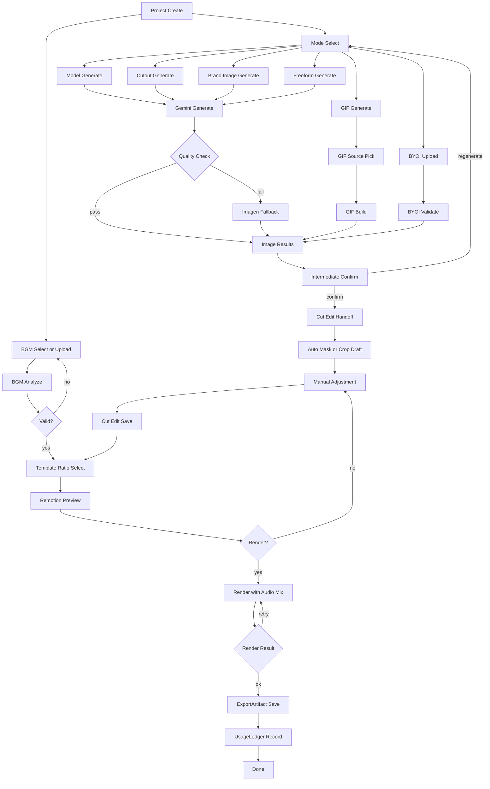

# Takdi User Flow

Version: 1.3.0
Last Updated: 2026-03-05 (KST)

Related spec:
- `docs/ref/WIREFRAME-NODE-BYOI.md`

## End-to-End Flow
1. Create project and select mode.
2. Run generation path (`Gemini -> Imagen fallback`) or BYOI path.
3. Confirm selected image and handoff to cut edit.
4. Analyze BGM and preview composition.
5. Render with Remotion and export artifacts.
6. Record usage and estimated cost.

## Flow Diagram

## Input Contract
| Field | Required | Rule |
|---|---|---|
| Brief text | Yes | TXT upload or direct paste |
| Images | Conditional | Required for non-BYOI modes |
| Mode | Yes | `model-shot`, `cutout`, `brand-image`, `gif-source`, `freeform`, `byoi` |
| BGM | Yes | Library select or MP3/WAV upload |
| Template ratio | Yes | `9:16`, `1:1`, `16:9` |
| Project name | No | Auto-generated if omitted |

## Status Transition
- Project: `draft -> generating -> generated -> exported`
- Project fail path: `draft -> generating -> failed`
- Image job: `queued -> running -> done | failed`

## Contract Keys
- `Asset.sourceType = uploaded | generated | byoi_edited`
- `CutHandoffPayload.preserveOriginal: boolean`

## Single-User Operation Rule
- UI exposes one-user flow only.
- Internal records remain workspace-scoped.
