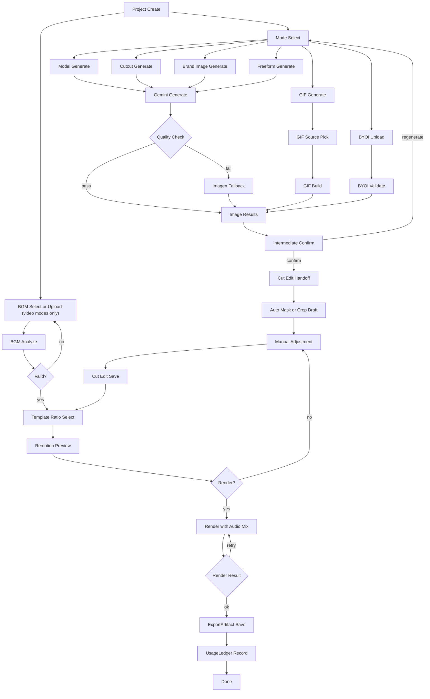

# Takdi Wireframe Spec (Editor Surface + BYOI)

Version: 1.1.0
Last Updated: 2026-03-08 (KST)
Owner: Product/Platform

## IA Summary
- Screen 1: Home (`/`)
- Screen 2: Node Editor (`/projects/:id/editor`)
- Screen 3: Result (`/projects/:id/result`)

## Screen Wireframes
### 1) Home
- Primary CTA: `Start New Project`
- Secondary CTA: `Use My Edited Image (BYOI)`
- Recent projects list (name, stage, updated time, resume action)
- Quick mode cards:
  - model-shot
  - cutout
  - brand-image
  - gif-source
  - freeform

### 2) Editor (`/projects/:id/editor`)
- Shared top global actions:
  - Run All
  - Stop
  - Save
  - Preview
  - Export
  - Open Compose
- Shared top controls:
  - project name edit button on the left
  - `간단 모드 / 전문가 모드` toggle on the right for `model-shot`, `cutout`, `brand-image`

#### 2-A) Simple Mode (default for fixed pipeline modes)
- Applies to:
  - `model-shot`
  - `cutout`
  - `brand-image`
- Left panel:
  - 없음
- Center:
  - step cards only
  - no node drag, edges, minimap, context menu
- Right panel:
  - single current-step panel
  - only user-facing fields and related files
- Hidden in simple mode:
  - node id
  - raw node type
  - history tab
  - cost tab
  - bottom live log panel
- `model-shot` step order:
  - 원본 이미지 업로드
  - 촬영 지시 입력
  - 모델 합성
  - 내보내기
- `model-shot` upload panel:
  - upload CTA
  - current thumbnail + filename
  - static help text for recommended count, composition guide, supported formats
  - no BGM upload
  - no free-form “간단 설명” input

#### 2-B) Expert Mode
- Left panel:
  - node palette
- Center:
  - node canvas and edges
- Right panel tabs:
  - 작업 내용
  - 파일
- Advanced metadata:
  - node id shown only inside `고급 정보`
  - raw node type shown only as secondary/internal text
- Bottom panel:
  - 없음

### 3) Result
- Artifact groups:
  - Images
  - GIF
  - Video (with audio)
- Actions:
  - Download
  - Copy share link
  - Re-open editor
  - Start new project
- Usage summary:
  - model/provider
  - image count
  - cost estimate
  - render duration

### 4) Settings
- Runtime/storage summary remains read-only
- Admin-style operations summary moved here from the editor:
  - monthly event count
  - export count
  - estimated total cost
  - recent activity list

## Integrated Flow

## Surface Rules
- `model-shot`, `cutout`, `brand-image` open in simple mode first.
- `freeform` and `gif-source` open in expert mode only.
- Editor view mode selection persists in localStorage per mode.
- In expert mode, the top-right mode toggle must stay clear of the centered action toolbar.

## Node Gate Rules
- `Intermediate Confirm` must be completed before `Cut Edit`.
- `BGM Analyze` should be valid before `Render` (warning or block policy).
- If `preserveOriginal=true`, BYOI source cannot be overwritten by auto edits.
- `BYOI Validate` checks format, EXIF orientation, color profile normalization, and ratio constraints.

## API and Type Contract Summary
### API
- `POST /api/projects`
- `POST /api/projects/:id/generate`
- `GET /api/projects/:id`
- `PATCH /api/projects/:id/content`
- `POST /api/projects/:id/export`
- `GET /api/usage/me`
- `POST /api/projects/:id/cuts/handoff`
- `POST /api/projects/:id/remotion/preview`
- `POST /api/projects/:id/remotion/render`
- `GET /api/projects/:id/remotion/status`

### Types
- `ProjectStatus = draft | generating | generated | failed | exported`
- `Asset.sourceType = uploaded | generated | byoi_edited`
- `CutHandoffPayload.preserveOriginal: boolean`

## Implementation Priority
1. MVP
  - Home CTA and recent work
  - Node editor shell
  - AI image generation and intermediate confirm
  - BGM analyze and Remotion preview/render
2. Expansion
  - BYOI lock policy hardening
  - provider routing controls
  - advanced node templates
