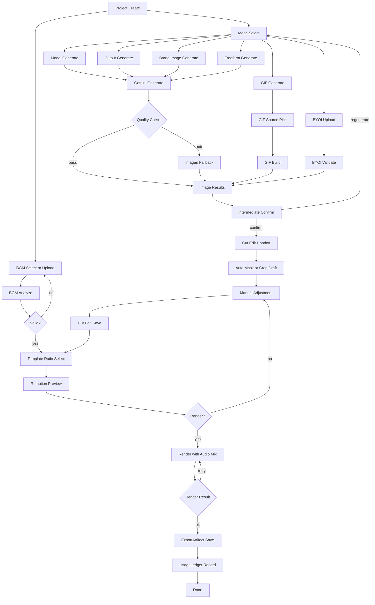

# Takdi Wireframe Spec (Node Editor + BYOI)

Version: 1.0.0
Last Updated: 2026-03-05 (KST)
Owner: Product/Platform

## IA Summary
- Screen 1: Home (`/`)
- Screen 2: Node Editor (`/projects/:id/editor`)
- Screen 3: Result (`/projects/:id/result`)

## Screen Wireframes
### 1) Home
- Primary CTA: `Start New Project`
- Secondary CTA: `Use My Edited Image (BYOI)`
- Recent projects list (name, stage, updated time, resume action)
- Quick mode cards:
  - model-shot
  - cutout
  - brand-image
  - gif-source
  - freeform

### 2) Node Editor (Main)
- Left panel: node palette
- Center: node canvas and edges
- Right panel tabs:
  - Node Settings
  - Assets
  - History
  - Cost
- Bottom panel: run logs and job states
- Top global actions:
  - Run All
  - Run Selected
  - Stop
  - Save
  - Preview
  - Export

### 3) Result
- Artifact groups:
  - Images
  - GIF
  - Video (with audio)
- Actions:
  - Download
  - Copy share link
  - Re-open editor
  - Start new project
- Usage summary:
  - model/provider
  - image count
  - cost estimate
  - render duration

## Integrated Flow

## Node Gate Rules
- `Intermediate Confirm` must be completed before `Cut Edit`.
- `BGM Analyze` should be valid before `Render` (warning or block policy).
- If `preserveOriginal=true`, BYOI source cannot be overwritten by auto edits.
- `BYOI Validate` checks format, EXIF orientation, color profile normalization, and ratio constraints.

## API and Type Contract Summary
### API
- `POST /api/projects`
- `POST /api/projects/:id/generate`
- `GET /api/projects/:id`
- `PATCH /api/projects/:id/content`
- `POST /api/projects/:id/export`
- `GET /api/usage/me`
- `POST /api/projects/:id/cuts/handoff`
- `POST /api/projects/:id/remotion/preview`
- `POST /api/projects/:id/remotion/render`
- `GET /api/projects/:id/remotion/status`

### Types
- `ProjectStatus = draft | generating | generated | failed | exported`
- `Asset.sourceType = uploaded | generated | byoi_edited`
- `CutHandoffPayload.preserveOriginal: boolean`

## Implementation Priority
1. MVP
  - Home CTA and recent work
  - Node editor shell
  - AI image generation and intermediate confirm
  - BGM analyze and Remotion preview/render
2. Expansion
  - BYOI lock policy hardening
  - cost panel and provider routing controls
  - advanced node templates
